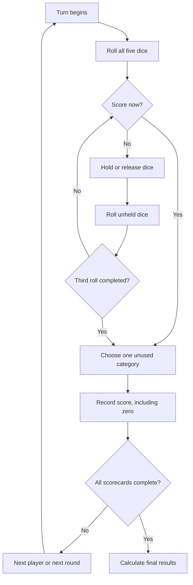

# Poker Dice Rules

## The game at a glance

Poker Dice is played with five ordinary six-sided dice. On each turn, roll the dice up to three times, keeping any dice you like between rolls. Then choose one unused category on your scorecard. Each category can be used only once, even when it scores zero.

The standard game has thirteen turns per player. The highest total wins in multiplayer. In solitaire, your final total determines an achievement level.

## What you need

- Five six-sided dice
- One thirteen-category scorecard for each player
- One to six players

The browser game supplies the dice, scorecards, and score calculations.

## Setup

Choose solitaire or local multiplayer. In multiplayer, enter two to six player names and choose their fixed playing order. Every scorecard starts empty.

A multiplayer game contains thirteen rounds. Every player receives one turn in each round. A solitaire game contains thirteen turns.

## Taking a turn

1. Roll all five dice.
2. After the roll, choose any dice you want to hold.
3. Either score the dice now or roll again. Only unheld dice are rolled.
4. After the second roll, you may change which dice are held, score, or roll once more.
5. After the third roll, choose an unused scoring category. You must choose a category even if it scores zero.
6. Record the score, clear all held dice, and pass play to the next player.

Holding all five dice does not automatically end the turn. You may score them immediately. If you deliberately roll while all five are held, the roll is consumed and no die changes.

## Scoring categories

Your dice may be entered in any unused category. The game shows the score each available category would receive before you choose it.

### Number categories

For Ones through Sixes, add only dice showing that number.

| Category | Example | Score |
| --- | --- | ---: |
| Ones | 1, 1, 2, 4, 6 | 2 |
| Twos | 2, 2, 2, 5, 6 | 6 |
| Threes | 1, 3, 3, 4, 5 | 6 |
| Fours | 2, 4, 4, 4, 6 | 12 |
| Fives | 1, 2, 5, 5, 5 | 15 |
| Sixes | 3, 4, 6, 6, 6 | 18 |

If the combined score for Ones through Sixes is at least 63, add a 35-point upper bonus.

### Combination categories

| Category | Requirement | Score |
| --- | --- | ---: |
| Three of a Kind | At least three dice match | Total of all five dice |
| Four of a Kind | At least four dice match | Total of all five dice |
| Full House | Exactly three of one number and two of another | 25 |
| Small Straight | Four consecutive numbers | 30 |
| Large Straight | Five consecutive numbers | 40 |
| Five of a Kind | All five dice match | 50 |
| Choice | Any five dice | Total of all five dice |

When a requirement is not met, that category scores zero.

Examples:

- `4, 4, 4, 2, 6` scores 20 as Three of a Kind.
- `5, 5, 5, 5, 2` scores 22 as Four of a Kind.
- `3, 3, 3, 6, 6` scores 25 as a Full House.
- `1, 2, 3, 4, 4` scores 30 as a Small Straight; duplicate dice do not invalidate the sequence.
- `2, 3, 4, 5, 6` scores 40 as a Large Straight.
- `6, 6, 6, 6, 6` scores 50 as Five of a Kind, but it is not a Full House.

There is no bonus for rolling Five of a Kind more than once, and Five of a Kind does not act as a wildcard for another category.

## Choosing a zero

Sometimes no useful category remains. You must still choose one unused category and record zero. Once recorded, that category cannot be used again.

## Ending the game

The game ends when every player has filled all thirteen categories.

Final score equals:

> all thirteen category scores + the 35-point upper bonus, when earned

### Multiplayer result

Players are ranked by total score. Ties are resolved by:

1. higher Ones-through-Sixes subtotal;
2. more categories with a score above zero.

If players are still tied, they share the rank. There is no tie-breaking roll.

### Solitaire result

| Final score | Achievement |
| ---: | --- |
| 0–149 | Novice |
| 150–199 | Competent |
| 200–249 | Skilled |
| 250–299 | Expert |
| 300 or more | Master |

These levels measure the completed game only. Reaching a level does not end the game early.

## Undo and saved games

In solitaire or practice play, undo and redo may be enabled. In standard multiplayer, undo may be restricted or disabled after play passes to the next person.

An in-progress game can be saved locally and resumed with the same dice, held dice, scorecards, turn, and remaining rolls. A replayable game uses the same recorded random sequence; visual dice animation does not influence the result.

## Future rule profiles

Later profiles may reproduce other members of the poker-dice family by changing category values, bonuses, straight definitions, or repeated Five-of-a-Kind rules. A profile is chosen before play and does not change during a game. Unless another profile is explicitly selected, the rules on this page are the complete standard rules.
