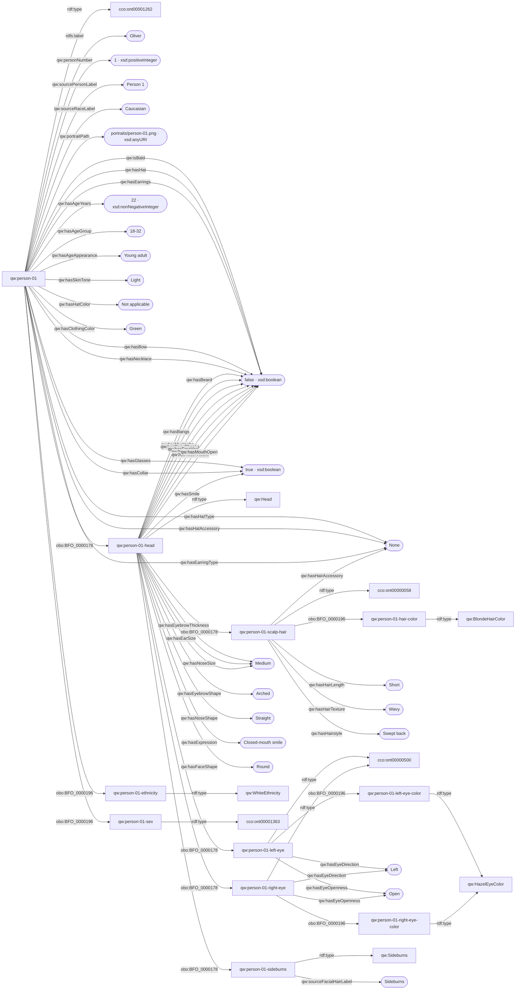

# Oliver: complete generated RDF instance

Includes explicit type edges and every source column. Generated from catalog-v1.ttl.

```mermaid
flowchart LR
  n0["qw:person-01"]
  n1["cco:ont00001262"]
  n2(["Oliver"])
  n3(["1 · xsd:positiveInteger"])
  n4(["Person 1"])
  n5(["Caucasian"])
  n6(["portraits/person-01.png · xsd:anyURI"])
  n7["qw:person-01-head"]
  n8["qw:person-01-ethnicity"]
  n9["qw:person-01-sex"]
  n10(["22 · xsd:nonNegativeInteger"])
  n11(["18-32"])
  n12(["Young adult"])
  n13(["false · xsd:boolean"])
  n14(["Light"])
  n15(["true · xsd:boolean"])
  n16(["None"])
  n17(["Not applicable"])
  n18(["Green"])
  n19["qw:Head"]
  n20["qw:person-01-scalp-hair"]
  n21["qw:person-01-left-eye"]
  n22["qw:person-01-right-eye"]
  n23["qw:person-01-sideburns"]
  n24(["Medium"])
  n25(["Arched"])
  n26(["Straight"])
  n27(["Closed-mouth smile"])
  n28(["Round"])
  n29["cco:ont00000058"]
  n30["qw:person-01-hair-color"]
  n31(["Short"])
  n32(["Wavy"])
  n33(["Swept back"])
  n34["qw:BlondeHairColor"]
  n35["cco:ont00000500"]
  n36["qw:person-01-left-eye-color"]
  n37(["Left"])
  n38(["Open"])
  n39["qw:HazelEyeColor"]
  n40["qw:person-01-right-eye-color"]
  n41["qw:WhiteEthnicity"]
  n42["cco:ont00001363"]
  n43["qw:Sideburns"]
  n44(["Sideburns"])
  n0 -->|rdf:type| n1
  n0 -->|rdfs:label| n2
  n0 -->|qw:personNumber| n3
  n0 -->|qw:sourcePersonLabel| n4
  n0 -->|qw:sourceRaceLabel| n5
  n0 -->|qw:portraitPath| n6
  n0 -->|obo:BFO_0000178| n7
  n0 -->|obo:BFO_0000196| n8
  n0 -->|obo:BFO_0000196| n9
  n0 -->|qw:hasAgeYears| n10
  n0 -->|qw:hasAgeGroup| n11
  n0 -->|qw:hasAgeAppearance| n12
  n0 -->|qw:isBald| n13
  n0 -->|qw:hasSkinTone| n14
  n0 -->|qw:hasGlasses| n15
  n0 -->|qw:hasHat| n13
  n0 -->|qw:hasHatType| n16
  n0 -->|qw:hasHatColor| n17
  n0 -->|qw:hasHatAccessory| n16
  n0 -->|qw:hasEarrings| n13
  n0 -->|qw:hasEarringType| n16
  n0 -->|qw:hasBow| n13
  n0 -->|qw:hasCollar| n15
  n0 -->|qw:hasNecklace| n13
  n0 -->|qw:hasClothingColor| n18
  n7 -->|rdf:type| n19
  n7 -->|obo:BFO_0000178| n20
  n7 -->|obo:BFO_0000178| n21
  n7 -->|obo:BFO_0000178| n22
  n7 -->|obo:BFO_0000178| n23
  n7 -->|qw:hasBangs| n13
  n7 -->|qw:hasBeard| n13
  n7 -->|qw:hasMustache| n13
  n7 -->|qw:hasEyebrowThickness| n24
  n7 -->|qw:hasEyebrowShape| n25
  n7 -->|qw:hasNoseSize| n24
  n7 -->|qw:hasNoseShape| n26
  n7 -->|qw:hasRosyCheeks| n13
  n7 -->|qw:hasFreckles| n13
  n7 -->|qw:hasDimples| n13
  n7 -->|qw:hasSmile| n15
  n7 -->|qw:hasTeethVisible| n13
  n7 -->|qw:hasMouthOpen| n13
  n7 -->|qw:hasExpression| n27
  n7 -->|qw:hasFaceShape| n28
  n7 -->|qw:hasEarSize| n24
  n20 -->|rdf:type| n29
  n20 -->|obo:BFO_0000196| n30
  n20 -->|qw:hasHairLength| n31
  n20 -->|qw:hasHairTexture| n32
  n20 -->|qw:hasHairstyle| n33
  n20 -->|qw:hasHairAccessory| n16
  n30 -->|rdf:type| n34
  n21 -->|rdf:type| n35
  n21 -->|obo:BFO_0000196| n36
  n21 -->|qw:hasEyeDirection| n37
  n21 -->|qw:hasEyeOpenness| n38
  n36 -->|rdf:type| n39
  n22 -->|rdf:type| n35
  n22 -->|obo:BFO_0000196| n40
  n22 -->|qw:hasEyeDirection| n37
  n22 -->|qw:hasEyeOpenness| n38
  n40 -->|rdf:type| n39
  n8 -->|rdf:type| n41
  n9 -->|rdf:type| n42
  n23 -->|rdf:type| n43
  n23 -->|qw:sourceFacialHairLabel| n44
```
