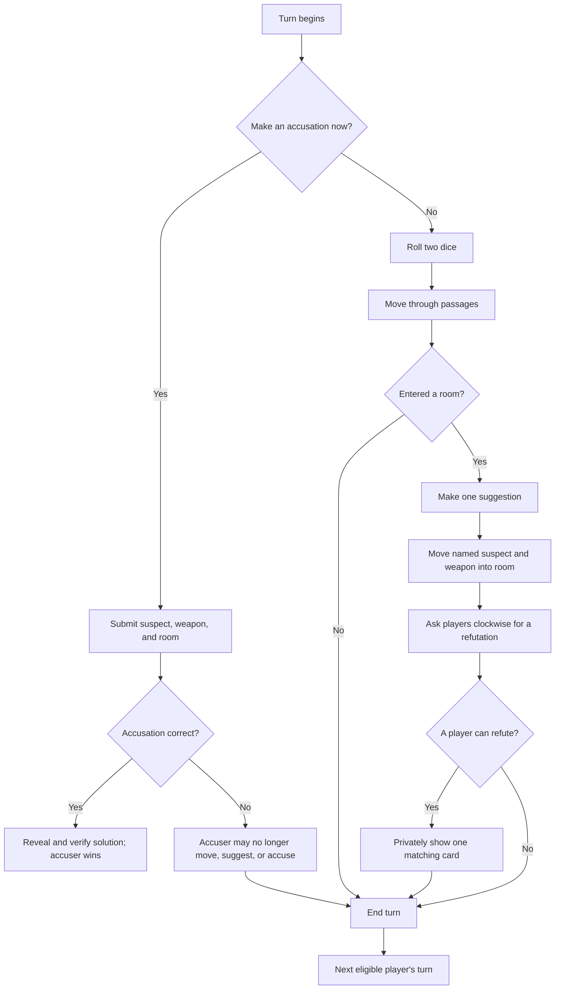

# Was It the Butler? — Game Rules

**Rules status:** Initial implementation draft  
**Players:** 3–6  
**Mode:** Pass-and-play or local multi-device  
**Objective:** Identify the concealed suspect, weapon, and room.

## 1. The mystery

A crime has been committed somewhere on the estate. One suspect, one weapon, and one room are sealed as the solution. The remaining cards are dealt among the detectives.

Win by making the first correct accusation naming all three solution cards.

## 2. Contents

### Suspects

- Mrs. Eggshell — white
- Lt. Marinara — red
- Ms. Peach — orange
- Mrs. Mint — green
- Prof. Mulberry — purple
- Mr. Brown — brown

### Weapons

- Shovel
- Baseball bat
- Pistol
- Rope
- Knife
- Electric guitar

### Rooms

- Ballroom
- Living Room
- Dining Room
- Kitchen
- Library
- Game Room
- Screened-in Porch
- Greenhouse
- Pool Room

The deck contains 21 unique cards: six suspects, six weapons, and nine rooms. The board contains the nine card rooms, connecting passages, the shared Foyer starting area, and any secret passages shown on the board. The Foyer is a board location but is not a room card and cannot be named in a suggestion or accusation.

## 3. Choose how to play

### Pass-and-play

Use one device for the board and every private hand. Before private information appears, the screen names the intended player. That player confirms, reviews their cards or notebook, and conceals the screen before passing it on.

This prevents accidental viewing during ordinary play, but everyone’s information still exists on the same device.

### Local multi-device

Use one host device for setup, the board, turns, dice, suggestions, and accusations. Each player opens the player page on a personal device and enters the table code, their chosen suspect, and private five-letter hand code shown by the host.

The player page contains that player’s starting hand and private detective notebook. It does not automatically receive later board changes; players follow the host screen and update their notebooks themselves.

The short table code identifies the game but contains no deal or solution. A private hand code reconstructs only its chosen suspect’s starting cards. Keep that five-letter code private because anyone who sees it together with the access details can display that hand.

## 4. Setup

1. Choose pass-and-play or local multi-device.
2. On the setup screen, select three to six suspect portraits in the desired turn order. Selecting a portrait marks it active; selecting it again removes it. The number selected is the player count, so duplicate suspects are impossible.
3. The game randomly selects one suspect, one weapon, and one room for the sealed solution.
4. The remaining 18 cards are shuffled and dealt one at a time. Some players may receive one more card than others.
5. In pass-and-play, each player privately reviews their hand in turn.
6. In multi-device play, the host presents a separate five-letter hand code to each player. Each player enters only their own code and access details.
7. Place every suspect token in the Foyer, including tokens not assigned to a player. Use the six nonblocking positions arranged around the Foyer so every active player has an open first move.
8. The first selected portrait takes the first turn. Play then follows the generated turn order.

The host publishes a cryptographic commitment to the sealed solution during setup. When the game ends, the revealed solution can be checked against that original commitment.

## 5. Turn cycle

## 6. Roll and move

Roll two six-sided dice on the host or shared page. Move up to the rolled total through connected passage spaces.

- Movement is orthogonal unless the board explicitly shows another connection.
- You may not enter the same passage space twice during one move.
- You may not pass through or finish on a passage occupied by another active token.
- Entering a room ends movement immediately.
- Exact count is not required to enter a room.
- A player who begins a turn in a room may leave through a doorway, use a shown secret passage instead of rolling, or remain to make a suggestion and end the turn.

Room interiors do not use movement squares. Multiple suspect and weapon tokens may occupy one room.

### Estate layout

The intended floorplan is organized in three broad bands:

- Back: Pool Room, Screened-in Porch, and Greenhouse.
- Middle: two narrow, side-by-side Library and Game Room spaces on the left, Ballroom in the center, and Kitchen above Dining Room on the right.
- Front: Living Room across the lower-left, the central Foyer, and Dining Room extending through the lower-right.

The minimum room/zone connections are:

- Library—Game Room and Library—Living Room;
- Game Room—Pool Room and Game Room—Ballroom;
- Pool Room—Screened-in Porch;
- Screened-in Porch—Greenhouse and Screened-in Porch—Ballroom;
- Greenhouse—Kitchen;
- Kitchen—Ballroom and Kitchen—Dining Room; and
- Foyer—Living Room, Foyer—Ballroom, and Foyer—Dining Room.

These are architectural relationships, not necessarily one-step moves. The final board overlay will insert individually addressable corridor squares and doorway nodes between them. Square identifiers are internal and do not need printed names. Until that overlay is finalized, the app uses room-to-room connections as a playable prototype.

## 7. Suggestions

After entering or beginning the turn in a room, you may make one suggestion consisting of:

- any suspect;
- any weapon; and
- the room your token currently occupies.

Move the named suspect token and weapon token into that room. The moved suspect remains there until moved normally or named by another suggestion.

Beginning with the next player clockwise, each player checks whether their hand contains at least one suggested card.

- A player with no matching card declares that they cannot refute, and the request passes clockwise.
- The first player with one or more matching cards must privately show exactly one of their choice to the suggester.
- Refutation stops after one card is shown.
- Nobody else may see which card was shown.

In pass-and-play, use the private reveal screen. In multi-device play, the refuting player selects the card on their own device and physically shows that device only to the suggester. The suggester records the information in their notebook.

## 8. Detective notebook

Your notebook is private. It may track:

- cards in your hand;
- cards shown to you;
- deductions about other players;
- freeform notes.

Notebook marks are aids, not authoritative game state. The game does not make deductions or correct mistaken notes.

## 9. Accusations

At the beginning of your turn, before rolling, you may make one accusation naming any suspect, weapon, and room. In the current playtest profile, your token does not need to be in the accused room or the Foyer.

**Open playtest decision:** a stricter variant would require returning to the Foyer before making an accusation. That makes the Foyer strategically meaningful and gives opponents warning, but it may lengthen an endgame whose deduction is already complete. The first implementation retains anywhere-at-turn-start accusations until playtesting selects the preferred rule.

The host compares the accusation with the sealed solution without first displaying the solution.

- If all three cards match, the solution is revealed, its setup commitment is verified, and the accuser wins.
- If any card differs, the accusation fails. The accuser is eliminated from taking turns, moving, suggesting, and accusing.
- An eliminated player keeps their cards and must continue refuting suggestions when able.

If every player but one is eliminated, the remaining eligible player does not automatically win; they must still make a correct accusation. If every player becomes eliminated, reveal and verify the solution and record that the mystery defeated the table.

## 10. Information and fairness

- Do not inspect another player’s device, hand code, or saved data.
- Keep private hand codes secret.
- The host device contains the full solution and every hand; the host operator is trusted not to inspect developer tools or storage.
- Pass-and-play concealment is a social privacy aid, not protection against deliberate device inspection.
- A player hand code cannot be revoked after it has been copied in the zero-server version.

## 11. Saving

The host may save the complete game locally. Player devices save only their own hand, notebook, and public game identification. Restoring the host does not automatically update player devices; starting hands remain valid because cards do not transfer during play.
